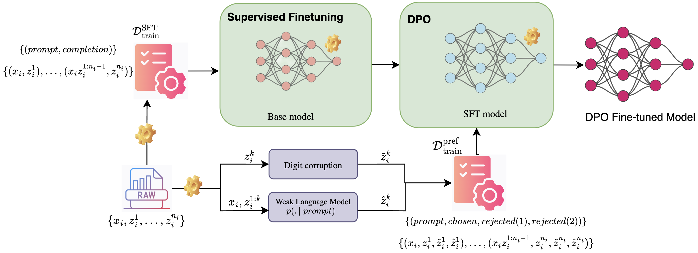

# Preference Optimization on Reasoning Traces (PORT)
This is the official code for the Preference Optimization on Reasoning Traces (PORT) paper which proposes using preference optimization techniques to chain-of-thought reasoning steps in order to enhance the reasoning performances of language models.




## Setup

For all of our experiments we used a node with <u>8 GPUS Nvidia A100 80GB</u> Memory and the following conda env:

- Create conda environment & activate
```angular2html
conda create -n port python=3.10
conda activate port
```

- Install requirements
```angular2html
pip install -r requirements.txt
```

- Install _**trl**_ from source
```angular2html
pip install git+https://github.com/huggingface/trl.git
```
- HF and W&B login
```angular2html
wandb login
huggingface-cli login --token <<YOUR_TOKEN>>
```
## Usage
#### Data Generation (`data/`) 
 - `all_in_one.py` used to generate full dataset used for all our fine-tuning experiments. This file is designed to be run on a node with 8 GPUs in order to generate 8 splits of the full dataset. To generate the data, use `bash data_script.sh`.
 - `extraction.py` this contain utils methods that help to extract the respective training dataset for SFT and DPO. 

#### Supervised Fine-Tuning (`sft/`)
- `sft.py` is modified version of HF official example to run the SFT experiment.
- `sft_script.sh` contains the command to run the SFT experiment via execute `bash sft_script.sh`. This required to have the SFT model.

#### Preference (`preference/`)
- `dpo.py` is modified version of HF official example for [DPO](https://arxiv.org/abs/2305.18290) & [IPO](https://arxiv.org/abs/2310.12036) experiments.
- `kto.py` is modified version of HF official example for [KTO](https://arxiv.org/abs/2402.01306) experiment.
- `orpo.py` is modified version of HF official example. To run the [ORPO](https://arxiv.org/abs/2403.07691) experiment.
- `o_script.sh` contains the command to run the fine-tuning with above methods via execute `bash o_script.sh`. This required to have the SFT model. 

## Evaluation
To evaluate the fine-tuned models, we used the lm-evaluation-harness. Clone the official repo on the `port/` directory:

```angular2html
git clone https://github.com/EleutherAI/lm-evaluation-harness
cd lm-evaluation-harness
pip install -e .
```
- To evaluate on the GSM8K task directly, set your arguments and run:

```
accelerate launch -m lm_eval --model hf  --model_args pretrained=<<YOUR_BASE_PATH>>,peft=<<YOUR_FINETUNED_MODEL_PATH>> --tasks gsm8k --log_samples --output_path=dpo_results --wandb_args project=<<W&B_PROJECT_NAME>>,name=<<RUN_NAME>>
```

- To evaluate on the AQUA-RAT CoT task, move the `eval_scripts/aqua-rat-cot.yaml` file to  `lm-evaluation-harness/lm-eval/task/agieval/`, then set your arguments and directly run:

```
accelerate launch -m lm_eval --model hf  --model_args pretrained=<<YOUR_BASE_PATH>>,peft=<<YOUR_FINETUNED_MODEL_PATH>> --tasks agieval_aqua_rat_cot --log_samples --output_path=dpo_results --wandb_args project=<<W&B_PROJECT_NAME>>,name=<<RUN_NAME>>
```

- To evaluate on the ARC Challenge CoT task, move the `eval_scripts/arc_challenge_cot.yaml` file to `lm-evaluation-harness/lm-eval/task/arc/`, then set your arguments and directly run:
```
accelerate launch -m lm_eval --model hf  --model_args pretrained=<<YOUR_BASE_PATH>>,peft=<<YOUR_FINETUNED_MODEL_PATH>> --tasks arc_challenge_cot --log_samples --output_path=dpo_results --wandb_args project=<<W&B_PROJECT_NAME>>,name=<<RUN_NAME>>
```
## Citation
_coming soon..._
